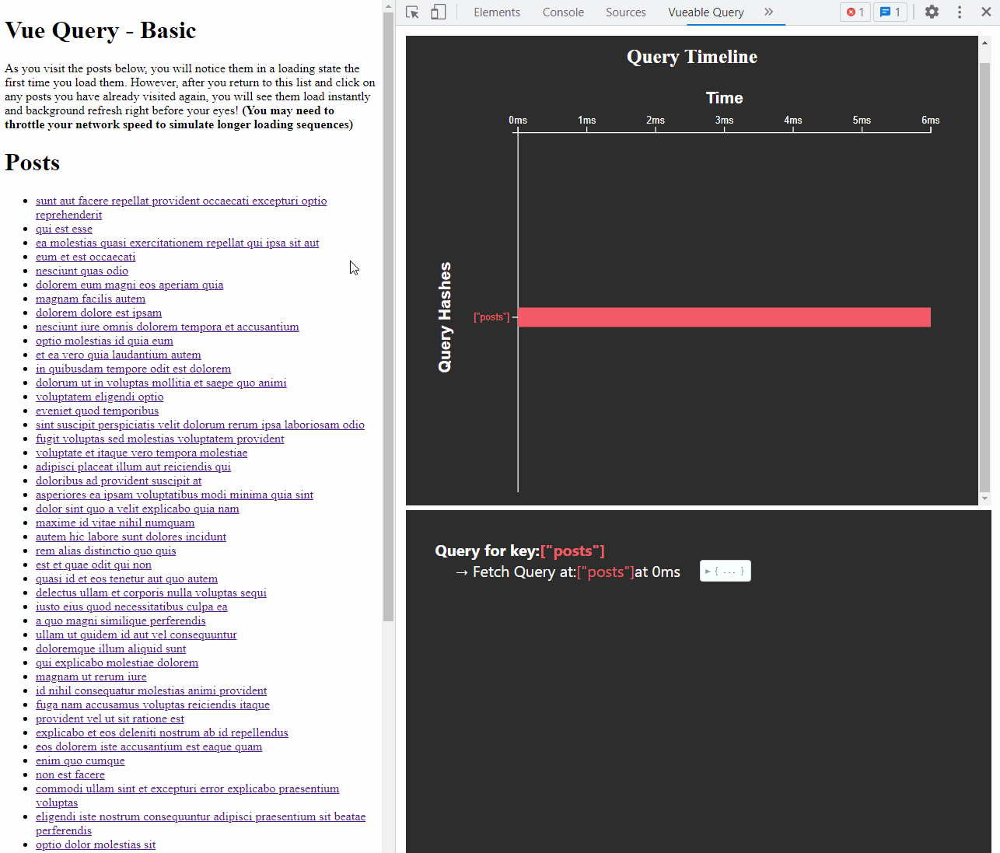

# Vueable-query

Vueable Query is an easy to use Chrome Extension that provides visualization and performance metrics for programs using [Tanstack Query for Vue](https://github.com/TanStack/query).

## Installation
- Fork this repository
- Run `npm install` then `npm run build` to build the extension to the dist folder
- In chrome, navigate to extension then load unpacked and select the dist folder

## Features

- A timeline to visualize the query history
- A text panel to display all relevant queries under their query key.
- Highlighting on click and hover
- Tooltip displayed on hover 

## Example Program
- Run with `npm run demo`
- Navigate to localhost:5173

## Usage
- View a program running Tanstack Query for Vue or load up the example program above
- Open up the Dev Tools for Chrome
- Navigate to Vueable Query pane

